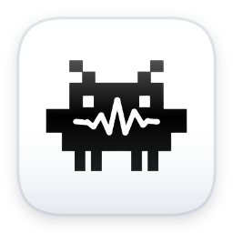

# Claude Voice Bar



macOS menu bar app. Double-tap `§`, speak your prompt, pick which Claude Code session to send it to. When Claude needs your approval, a popup appears — respond without touching the terminal. When Claude finishes a task, a banner lets you know.

```
§§               → start recording + show active sessions
speak            → recording in background
1 / 2 / 3 / ... → stop + transcribe + send to selected session
Esc              → cancel

§ (single)       → focus permission popup (when visible)
↑ / ↓            → navigate options
Enter            → confirm
```

## Why

Claude Code lives in the terminal. When you're working across multiple projects, you end up with several terminal windows open — and switching to the right one every time you want to send a prompt breaks your flow.

Claude Voice Bar lets you stay wherever you are: press `§§`, speak — and keep clicking around while it records. Pick the session, done. No window hunting, no context switch. When Claude needs your approval, the popup comes to you.

## Requirements

- macOS 13+
- [Homebrew](https://brew.sh)
- Claude Code installed

## Installation

1. [Download ClaudeVoiceBar.dmg](https://github.com/m-jachym/claude-voice-bar/releases/latest/download/ClaudeVoiceBar.dmg)
2. Drag `ClaudeVoiceBar` to Applications
3. Launch Claude Voice Bar from Applications
4. A Terminal window opens automatically — follow the setup (installs tmux, whisper-cpp, and the `claude-vb` command)
5. Grant Accessibility and Microphone permissions when prompted — the app restarts automatically

## Multiple accounts

Claude Voice Bar supports multiple Claude Code accounts (e.g. personal + work) without logging in and out.

Set up an additional profile from the menu bar icon → **Add profile...**

Then use:

```bash
claude-vb          # personal account
claude-vb work     # work account
```

Each profile runs in its own tmux session with an isolated Claude config. Voice Bar labels sessions by profile in the session picker.

## Usage

Use `claude-vb` instead of `claude` to start sessions:

```bash
cd ~/your-project
claude-vb
```

This opens Claude Code in a tmux session. Claude Voice Bar detects all open sessions and lets you send voice prompts to any of them.

## How it works

```
§§ → detect active Claude sessions via tmux
   → start recording (AVAudioRecorder, 16kHz mono WAV)

number key / click → stop recording
                   → transcribe via whisper-cpp (small model, Polish + English)
                   → send text to selected tmux session via tmux send-keys

Claude needs permission → Notification hook fires claude-vb-notify
                        → parses tmux pane output (title + options)
                        → writes JSON to /tmp/claude-vb-notify
                        → FSEvents wakes Voice Bar → permission popup appears
                        → § focuses popup → CGEventTap captures keys
                        → user picks option → tmux send-keys to Claude session

Claude finishes task   → Stop hook fires claude-vb-stop
                        → writes JSON to /tmp/claude-vb-notify
                        → FSEvents wakes Voice Bar → banner appears for 5s
```

## Stack

Swift 5.9, SwiftUI, AVFoundation, whisper.cpp, tmux
